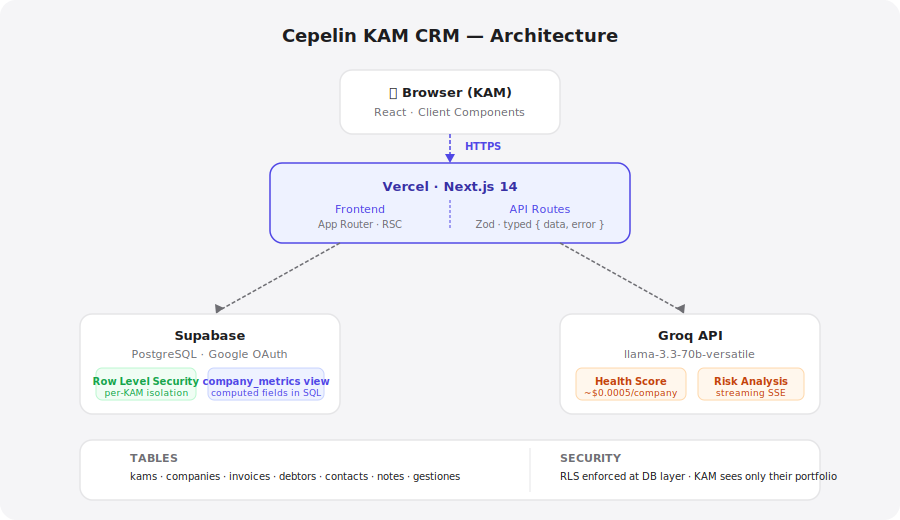

# Cepelin KAM CRM

A portfolio management tool for Key Account Managers at a B2B factoring fintech operating in Chile and Mexico.

## What it does

- Shows every company in a KAM's portfolio ranked by urgency — who needs attention today, this week, or is on track
- Tracks how much of each client's invoice volume goes through Cepelin vs. competitors (Share of Wallet), and flags drops
- Generates an AI health score per company using invoice data, recent KAM activity, and qualitative context — with plain-language reasoning and concrete next actions
- Records KAM interactions (calls, WhatsApp, emails, meetings) and sets recontact dates that drive urgency labels automatically

## Live demo

https://cepelin-crm.vercel.app

Sign in with any Google account. The app provisions a demo portfolio automatically on first login.

## Architecture



Every request flows through typed Next.js API routes → Supabase server client → PostgreSQL. Row Level Security in Postgres ensures a KAM can only ever read or write their own portfolio — the API layer is a second check, not the only one. Computed fields (credit used, SOW %, days since last operation) live in a SQL view, not in application code.

## Tech stack

| Layer | Choice |
|---|---|
| Framework | Next.js 14 (App Router) + TypeScript strict |
| Database | PostgreSQL via Supabase |
| Auth | Google OAuth via Supabase Auth |
| UI | Tailwind CSS + shadcn/ui + Recharts |
| AI | Groq API (llama-3.3-70b-versatile) |
| Deploy | Vercel |

## Getting started

```bash
# 1. Install dependencies
pnpm install

# 2. Copy env file and fill in values (see table below)
cp .env.example .env.local

# 3. Run migrations in Supabase SQL editor (in order)
# Paste files from supabase/migrations/ starting at 0001

# 4. Seed demo data
SEED_KAM_EMAIL=your@email.com pnpm seed

# 5. Start
pnpm dev
```

Open http://localhost:3000 and sign in with the Google account matching `SEED_KAM_EMAIL`.

## Environment variables

| Variable | Description |
|---|---|
| `NEXT_PUBLIC_SUPABASE_URL` | Your Supabase project URL |
| `NEXT_PUBLIC_SUPABASE_ANON_KEY` | Supabase anon key (safe to expose) |
| `SUPABASE_SERVICE_ROLE_KEY` | Service role key — server only, never client |
| `GROQ_API_KEY` | Groq API key for AI health scores |
| `SEED_KAM_EMAIL` | Google email that owns the seeded demo portfolio |
| `SEED_RESET` | Set to `true` to wipe and reseed from scratch |

## Key product decisions

- **Urgency is computed, not entered.** The app derives whether a company needs attention today, this week, or is fine — from invoice states, recontact dates, KAM activity, and AI signals. KAMs don't manage a status field; the data does it for them.
- **Every new login gets a full portfolio.** The first OAuth callback clones the demo dataset for that email. Evaluators and new KAMs see real data immediately, with no setup step.
- **AI scores explain themselves.** Health scores come with a plain-language summary and 2–4 specific recommended actions. A score without reasoning is useless to a KAM on a call.
- **Share of Wallet only counts active invoices.** SOW is calculated from invoices currently outstanding — not historical volume. A company with no active invoices shows `—`, not a misleading 100%.
